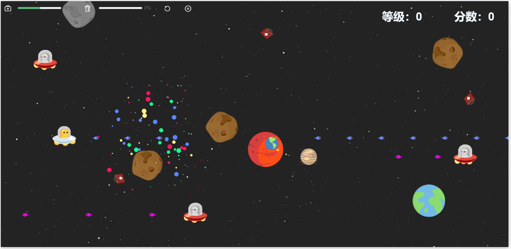

# plant_hegemony
## introduction


>~~拾取掉落的子弹箱，依靠时有时无的补给，打败邪恶小🛸，躲避迎面而来的陨石，最终和神秘天王来一场殊死决战吧~~

这是一个基于h5和 `typescript`的飞机大战小游戏，使用h5的`requestAnimationFrame`接口进行canvas渲染，是基于[star-battle](https://github.com/gd4Ark/star-battle)的ts重构和改进

## Setting Explanation
1. `w, a, s, d`移动控制，全自动开火，`space`召唤分身小弟，`G`召唤🦈魔灵
2. 拾取随机掉落的补给子弹包，可以获得武器升级，武器最高可达4级，武器满级后，将获得酷炫环绕特效~~以展示您强大的威仪~~，**注意，当您收到攻击时，武器等级会自动下降一级**
3. 拾取加油包，可以获得生命值加成，遭到攻击时生命值会下降，当您的生命值超过50%时，才可以释放召唤小弟技能。
4. 普通子弹击败敌人，可获得死亡敌人生命值的一半作为能量加成。
## 技能详解
* 召唤小弟
    > * 召唤小弟帮忙攻击，也可以帮助自己在必要的时候挡子弹 
    > * 召唤小弟时，将消耗自身当前一半的生命值召唤三个小弟，每个小弟的生命值跟自身当前生命值有关，小弟无法控制，会自主攻击和移动
* 🦈魔灵攻击
    > * 毁天灭地的神技，耗尽所有能量在机身旁边映射三条深渊巨🦈的投影，巨🦈投影在短暂的一秒蓄力之后会向前疯狂啃食，吞噬遇到的一切，对途径的所有敌人造成巨量伤害。
    > * 巨🦈环绕：锁定技，开始投影时，巨🦈真灵将传送自身力量到目标地点生成投影在一秒蓄力时间内由于巨🦈能量逐渐聚集，威力霸道强劲，所以此时所有靠近投影区域的敌人都将直接灰飞烟灭。
## 难度升级说明
* 难度1：陨石被神秘天王赋予了邪恶能量，陨石将在未击中的情况下二次反弹
* 难度2：邪恶小🛸刷新数量增加一倍
* 难度3：陨石刷新数量增加一倍
* 难度4：神秘天王亲临战场🐱‍👤
## Project setup
```
npm install
```

### Compiles and hot-reloads for development
```
npm run serve
```

### Compiles and minifies for production
```
npm run build